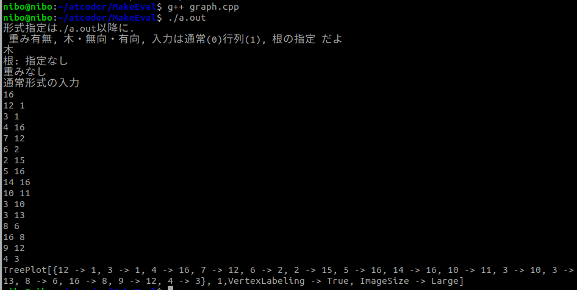
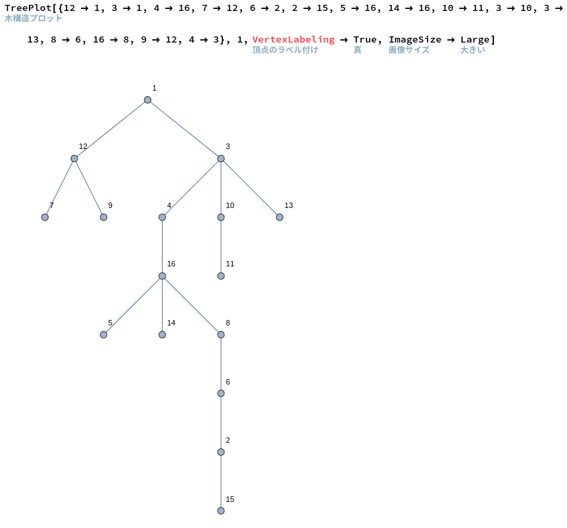

# グラフ描画補助(名前はまだ決めてない)
**使い方分からなかったら聞いて!!!**

学校の課題で作品作らなきゃいけない!!ってなったのでどうにか頑張って作った。

READMEを読むにあたって,「グラフを描画する」と,いかにも自分が描画するためのコードを書いたかのような匂いを漂わせているところがありますが,これは見栄をはっているだけで,実際はWolframのアレが頑張ってくれてます.

## 機能の概要

競技プログラミングでよく使うグラフの入力形式を用いて,グラフを描画するための式を出力します.

具体的には,Wolfram言語が出力されるので,[Wolframのコレ](https://www.open.wolframcloud.com/env/3a423f32-cc40-4996-bd1e-5c83326ca14e)に式をﾍﾟｯって貼り付けてShift+Enterで実行しましょう.

するとグラフが出てきます!(ステキ!!)

## 使う環境,使い方

c++のファイルを実行出来る環境があればOK!!!(多分)

graph.cppを取ってきて,コンパイルして実行して(必要に応じてコマンドライン引数も設定)

出力結果を[Wolframのコレ](https://www.open.wolframcloud.com/env/3a423f32-cc40-4996-bd1e-5c83326ca14e)に貼り付ける.するとグラフが見える.

## 実行例

↓↓↓ こんな感じﾔﾖ~



<br>

**通常形式の入力**ってところまではデバック出力です(./a.out > filename.txtをしたときに,filename.txtには保存されない出力.)

で,16 からの15行が(木なので16頂点なら辺は15個)与える入力.(ここは手動で入力する)

(もちろん,入力はテキストからも出来るわよ)

```commonlisp
./a.out < samplein/tree
```

(samplein/treeには,上の画像の16頂点15辺の入力が書いてあるよ)


**TreePlot...**ってところが出力なので,ここをコピーして,,[Wolframのコレ](https://www.open.wolframcloud.com/env/3a423f32-cc40-4996-bd1e-5c83326ca14e)に式をﾍﾟｯって貼り付けてShift+Enterで実行しましょう.

すると…!

ﾜｯｽｯｹﾞｪ!!グラフだ!!<br>

## 機能一覧

コマンドライン引数は4つまで渡せます.(./a.out の後に,4つまで数字を入力出来る)

コマンドライン引数を設定することで,

1. グラフの入力形式

   1. グラフの入力が,N頂点,K個の辺,重みなし
   2. N頂点の木(辺がN-1個),重みなし
   3. N頂点の木,辺に重み有り
   4. N頂点K辺,辺に重み有り
   5. N頂点,行列形式で辺が与えられる

2. 根の指定

   デフォルトでは根が,登場する頂点の一番若い数字だが,根の頂点番号を指定できる

3. グラフの形?の指定

   1. 木として描画する(ための式を作成する)
   2. 無向グラフとして描画する
   3. 有向グラフとして描画する

(辺がN-1個じゃないとき,木として描画しようとするとどうなるのかは知りません)

### コマンドライン引数について

```
./a.out x1 x2 x3 x4
```

 と言う形で実行する.

コマンドライン引数(x1,x2,x3,x4)は省略可能です.

```
./a.out
```

のみで実行した場合は,「**重みなし, 木, 根は一番若い頂点番号, 入力形式は通常** 」として実行されます.

```
./a.out	
```

でEnterを押した後で,

```
4
1 2
2 3
1 4
```

のように,N(=4=頂点の数)とN-1(=3)本の辺(1と2に辺あり,2と3に辺あり,1と4に辺あり)を入力で与えます.

ちなみに,通常というのは,僕の感覚なので異論は認めます.

僕は,「**N頂点 (辺がK本 もしくは 木) 重みなし**」を通常と感じています.<br>

ちなみに,Kは辺の数が指定されていませんが,感覚では通常です.

与えるコマンドライン引数によって,入力から正しい出力結果が得られなくなってしまいます.<br>

そのため,引数と入力形式の対応を書いていきます.

```
./a.out x1 x2 x3 x4
```

1. x1: 重み付きグラフか否か (0: 重みなし, 1:重みあり)
2. x2: 描画するグラフを木・無向・有向グラフのどれにするかの指定 (0:木, 1:無向グラフ, 2:有向グラフ)
3. x3: 入力形式が 行列の形式で与えられるか, そうでないか(0: 行列じゃない, 1:行列)
4. x4: 根の頂点を何にするかの指定(存在しない頂点番号にしたら,描画時にエラーが出る)

```
//行列形式って言うのはこんな感じ(ちなみに実行は ./a.out 0 1 1 (重みなし, 無向, 行列)
6
010110
101001
010100
101000
100000
010000
// 行列形式で重み付きも出来るよ.その場合は,数字の間に空白が必要
例(n=3, 0は辺無しとしてる) (./a.out 1 0 1)
3
0 10 13
10 0 0
13 0 0 
// これは,頂点 1 <-> 2 が辺の重み10 , 頂点 1 <-> 3 が辺の重み13 のときの入力
```

コマンドライン引数は,後ろの方を指定するためには,前のものも0か1か入れないといけません。つまりxj を指定したならxi (i < j)も指定しなきゃいけないってことです。

具体的には入力形式を指定したい(行列にしたい)場合には,重みの有無,描画するグラフが木・無向・有向かのx1とx2も指定しないといけません。

xiまで指定したときxj(i<j)は,デフォルトの物が与えられます.

デフォルトっていうのは,**「N頂点の木, 重みなし」 ** です.

よって,

```./a.out
./a.out
```

(コマンドライン引数無し)で実行したときはN頂点 N-1本の辺の入力が許されます.

割とよくある,「**N頂点 K辺, 辺に重みありの無向グラフ**」のときの実行方法は

```
./a.out 0 1 
```

(x1 = 0: 木じゃない, x2 = 1(無向グラフ) )です.

## 本当はやりたかったこと(いつかやるかも)

- 実行して生成した式を,[Wolframさんのコレ](https://www.open.wolframcloud.com/env/3a423f32-cc40-4996-bd1e-5c83326ca14e)じゃなくて,手元でWolfram言語を動かして見れるようにしたかった.

- コードがぐちゃぐちゃしてる

  特に,コマンドライン引数の扱いが,説明しないと分からないレベルで酷い

- よく有る考察に使えるグラフをすぐ描画するための式を作成する機能がほしかった

  例えば,5頂点 完全 とかを指定して,5頂点の完全グラフの式を作る機能

- なんかフレームワークとかいうやつを使って頑張ってみたかった

## アドバイス

よく使う N頂点K本重みなしの辺っていう入力を与えたい時は,

```
./a.out 0 1
```

N頂点K本の辺重み有りのときは,

```
./a.out 1 1
```


## でも

まぁさ,頑張ったと思うよ…

結局得た知識はあまり使わなかったけど,これを開発(?)する前にN予備で3日間も勉強したんだ.(Node.jsとかSQLとか)

